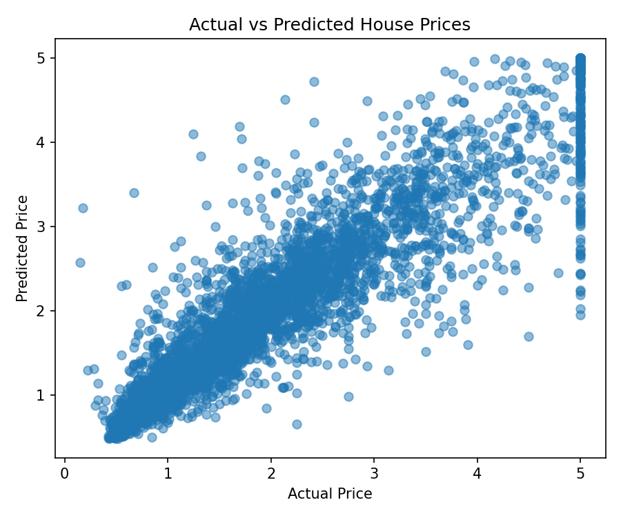
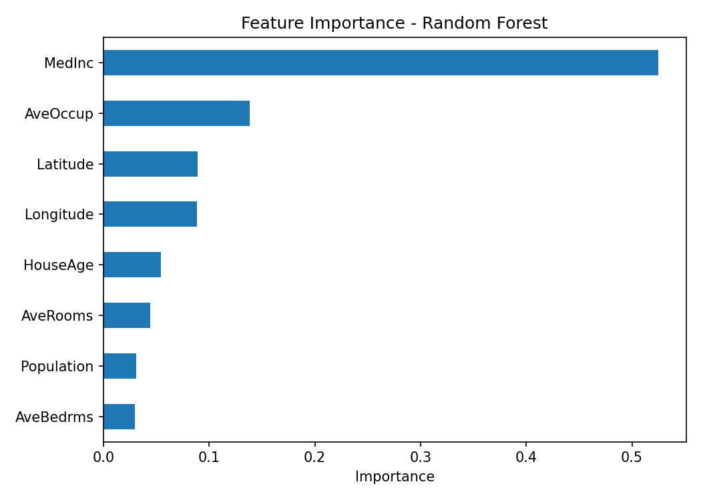

# House Price Prediction with Explainable AI

## Project Overview
This project shows a regression workflow using Python and explainable AI techniques. We used the California Housing dataset from scikit-learn and built a Random Forest model to predict house prices.

## Problem Statement
House price prediction is a common regression problem, but prediction alone is not enough. It is also important to understand which features influence the model the most. This project focuses on both prediction and interpretation.

## Solution
We trained a Random Forest Regressor on the California Housing dataset and evaluated the model using regression metrics. We also created visual outputs to make the model easier to explain.

The project includes:
- MAE
- RMSE
- R2 score
- actual vs predicted chart
- feature importance chart

## Tools and Technologies
- Python
- pandas
- scikit-learn
- matplotlib

## Files
- `house_price_xai.py` – model training, evaluation, and chart generation
- `requirements.txt` – project dependencies

## How to Run
Install dependencies:

`pip install -r requirements.txt`

Run the project:

`python house_price_xai.py`

## Key Results
This project gives a clear example of a regression workflow with explainability. It shows how a model can be used for prediction while still giving understandable information about feature importance.

## Visualization

## What We Learned
We learned how to build a regression model, evaluate its performance, and explain the results using feature importance. This made the project easier to understand and present.

## Team Member
- Manoj Bhatta
